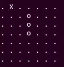

# Snake AI
Gameplay
-----

Purpose
------
Create an AI using Deep Q-learning to play snake.

Input / Output
------
The input contains 49 elements. Each element correspond to a location on the board which contains information of what is at location (food, body, or nothing).\
The output is the 4 possible moves that it can make (up, down, left, or right).

Result
------
After training, it learns to find the food and avoid its own body most of the time. 
However, there is little evident that it developed a strategy, and sometime it will moves in an infinite loop.\
Using Deep Q-learning to play snake requires lots of data because there need to be enough data in each scenario for it to be confident in predicting the future to formulate a strategy.